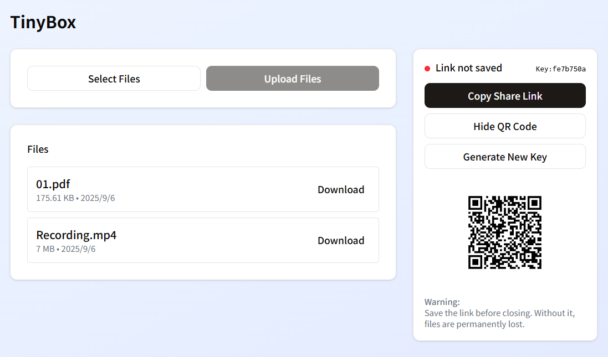

<div align="center">
  <h1>TinyBox</h1>
  <p>Secure end-to-end encrypted file sharing</p>
</div>
<br>
<br>



## Features

- **E2E Encryption**: Files are encrypted on the client side before upload, ensuring that only the intended recipient can decrypt and access them.
- **User-Friendly Interface**: Intuitive and easy-to-use web interface for uploading and sharing files.
- **Simple Web App**: Built with modern web technologies including Astro, React and Prisma. Easy to understand and modify.
- **Open Source**: The source code is available for review and contributions on [GitHub](https://github.com/omasakun/tinybox).

## Development

```bash
# asdf: https://asdf-vm.com/guide/getting-started.html
# vfox: https://vfox.lhan.me/guides/quick-start.html
# pnpm: https://pnpm.io/installation

# Install dependencies
asdf install  # On windows, you can use vfox instead
pnpm install

# Some npm scripts are defined in package.json
pnpm build       # Build the project
pnpm db:migrate  # Run database migrations
pnpm start       # Start the app
```

## License

This project is licensed under the [MIT License](LICENSE).

Copyright 2025 omasakun
